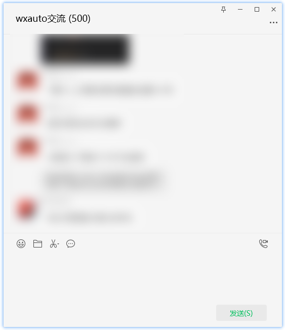

# 聊天窗口对象

聊天窗口对象指的是**监听消息**模式下打开的独立聊天窗口，这个对象用于对该独立窗口的管理，包括获取聊天窗口的消息、发送消息等。

**支持属性：**

| 属性名 | 类型 | 说明 | 
| :----: | :----: | :--: |
| who | str | 当前聊天窗口的对象名 |
| UiaAPI | uiautomation.Control | 当前聊天窗口的uiautomation控件 |
| editbox | uiautomation.Control | 当前聊天窗口**输入框**的uiautomation控件 |

**支持方法：**

| 方法名 | 说明 |
| :----: | :--: |
| AtAll | @所有人 |
| SendMsg | 发送消息 |
| SendFiles | 发送文件 |
| GetAllMessage | 获取消息 |
| GetNewMessage | 获取新消息 |
| LoadMoreMessage | 加载更多消息 |
| GetGroupMembers | 获取群成员 |
