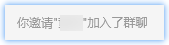
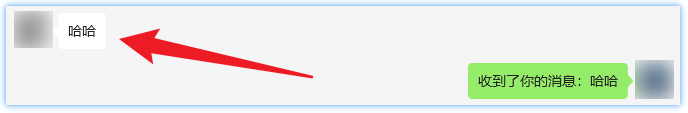
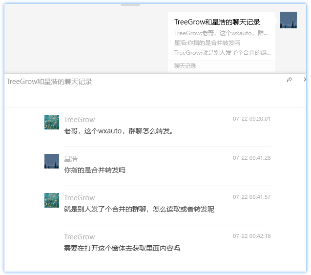
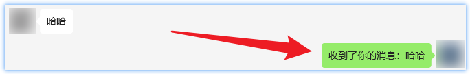

# 消息对象

消息对象指的是调用GetAllMessage、GetListenMessage等方法后返回的消息对象，分为物种消息类型，分别是`系统消息` `时间消息` `撤回消息` `好友消息` `自己的消息`，消息对象包含了消息的所有信息，包括消息类型、消息内容、消息发送者等。

## 1. 系统消息



**支持属性：**
| 属性名 | 类型 | 说明 | 
| :----: | :----: | :--: |
| type  | str | 消息类型，固定为`sys` |
| content | str | 消息内容 |
| sender | str | 发送者，固定为`SYS` |
| info | list | 原始消息信息，包含了消息的所有信息 |
| control | uiautomation.Control | 该消息的uiautomation控件 |
| id | str | 消息id |

```python title="Python"
...  # 此处省略wx对象的初始化
msgs = wx.GetAllMessage()
for msg in msgs:
    if msg.type == 'sys':
        print(f'【系统消息】{msg.content}')
```

## 2. 时间消息


**支持属性：**
| 属性名 | 类型 | 说明 |
| :----: | :----: | :--: |
| type | str | 消息类型，固定为`time` |
| content | str | 消息内容 |
| sender | str | 发送者，固定为`Time` |
| time | str | 时间消息内容，格式为`%Y-%m-%d %H:%M` |
| info | list | 原始消息信息，包含了消息的所有信息 |
| control | uiautomation.Control | 该消息的uiautomation控件 |
| id | str | 消息id |

```python title="Python"
...  # 此处省略wx对象的初始化
msgs = wx.GetAllMessage()
for msg in msgs:
    if msg.type == 'time':
        print(f'【时间消息】{msg.time}')
```

## 3. 撤回消息


**支持属性：**
| 属性名 | 类型 | 说明 |
| :----: | :----: | :--: |
| type | str | 消息类型，固定为`recall` |
| content | str | 消息内容 |
| sender | str | 发送者，固定为`Recall` |
| info | list | 原始消息信息，包含了消息的所有信息 |
| control | uiautomation.Control | 该消息的uiautomation控件 |
| id | str | 消息id |

```python title="Python"
...  # 此处省略wx对象的初始化
msgs = wx.GetAllMessage()
for msg in msgs:
    if msg.type == 'recall':
        print(f'【撤回消息】{msg.content}')
```

## 4. 好友消息



**支持属性：**
| 属性名 | 类型 | 说明 |
| :----: | :----: | :--: |
| type | str | 消息类型，固定为`friend` |
| content | str | 消息内容 |
| sender | str | 发送者 |
| sender_remark | str | 发送者备注名 |
| info | list | 原始消息信息，包含了消息的所有信息 |
| control | uiautomation.Control | 该消息的uiautomation控件 |
| id | str | 消息id |

```python title="Python"
...  # 此处省略wx对象的初始化
msgs = wx.GetAllMessage()
for msg in msgs:
    if msg.type == 'friend':
        sender = msg.sender # 这里可以将msg.sender改为msg.sender_remark，获取备注名
        print(f'{sender}：{msg.content}')
```

**支持方法**
| 方法名 | 说明 |
| :----: | :--: |
| quote | 引用消息进行回复，唯一参数msg，str类型 |
| forward | 转发消息，唯一参数friend，str类型 |
| parse | 解析合并消息内容，当且仅当消息内容为合并转发的消息时有效，返回列表 |

```python title="Python"
...  # 此处省略wx对象的初始化
msgs = wx.GetAllMessage()
for msg in msgs:
    if msg.type == 'friend':
        msg.quote('回复消息')  # 引用消息进行回复
        break
```

### 4.3 解析合并消息内容（parse方法）



该方法为解析合并消息内容，当且仅当消息内容为合并转发的消息时有效，返回列表。
```python title="Python"
...  # 此处省略wx对象的初始化
msgs = wx.GetAllMessage()
msgs[-1].parse()   # 解析合并消息内容，可以用msg.content == '[聊天记录]' 来判断是否为合并消息

# 返回值示例
# [
#     ['TreeGrow', '老哥，这个wxauto，群聊怎么转发。', '2024-07-22 09:20:01'],
#     ['星浩', '你指的是合并转发吗', '2024-07-22 09:41:28'],
#     ['TreeGrow', '就是别人发了个合并的群聊，怎么读取或者转发呢', '2024-07-22 09:41:57'],
#     ['TreeGrow', '需要在打开这个窗体去获取里面内容吗', '2024-07-22 09:42:18']
# ]
```

## 5. 自己的消息



**支持属性：**
| 属性名 | 类型 | 说明 |
| :----: | :----: | :--: |
| type | str | 消息类型，固定为`self` |
| content | str | 消息内容 |
| sender | str | 发送者 |
| info | list | 原始消息信息，包含了消息的所有信息 |
| control | uiautomation.Control | 该消息的uiautomation控件 |
| id | str | 消息id |

```python title="Python"
...  # 此处省略wx对象的初始化
msgs = wx.GetAllMessage()
for msg in msgs:
    if msg.type == 'self':
        print(f'{msg.sender}：{msg.content}')
```

**支持方法**
| 方法名 | 说明 |
| :----: | :--: |
| quote | 引用消息进行回复，唯一参数msg，str类型 |
| forward | 转发消息，唯一参数friend，str类型 |
| parse | 解析合并消息内容，当且仅当消息内容为合并转发的消息时有效，返回列表 |


### 5.1 引用消息进行回复（quote方法）
```python title="Python"
...  # 此处省略wx对象的初始化
msgs = wx.GetAllMessage()
for msg in msgs:
    if msg.type == 'self':
        msg.quote('回复消息')  # 引用消息进行回复
        break
```

### 5.2 转发消息（forward方法）
```python title="Python"
...  # 此处省略wx对象的初始化
msgs = wx.GetAllMessage()

# 转发消息给好友
friend = '好友昵称'  # 昵称、备注、微信号都可以，手机号不可以
msgs[-1].forward(friend)   # 转发最后一条消息给指定好友
```

### 5.3 解析合并消息内容（parse方法）


该方法为解析合并消息内容，当且仅当消息内容为合并转发的消息时有效，返回列表。
```python title="Python"
...  # 此处省略wx对象的初始化
msgs = wx.GetAllMessage()
msgs[-1].parse()   # 解析合并消息内容，可以用msg.content == '[聊天记录]' 来判断是否为合并消息

# 返回值示例
# [
#     ['TreeGrow', '老哥，这个wxauto，群聊怎么转发。', '2024-07-22 09:20:01'],
#     ['星浩', '你指的是合并转发吗', '2024-07-22 09:41:28'],
#     ['TreeGrow', '就是别人发了个合并的群聊，怎么读取或者转发呢', '2024-07-22 09:41:57'],
#     ['TreeGrow', '需要在打开这个窗体去获取里面内容吗', '2024-07-22 09:42:18']
# ]
```

