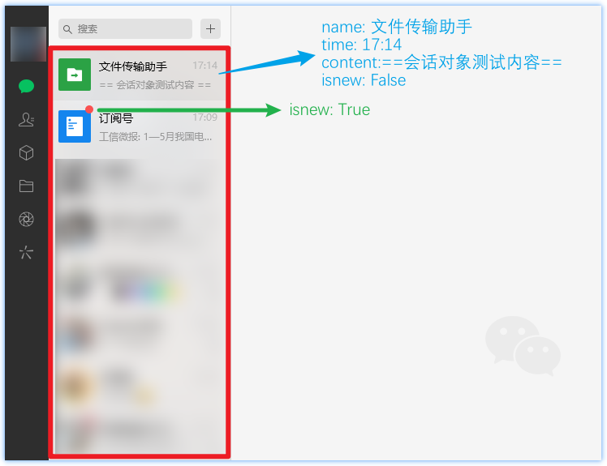

# 会话列表对象

会话列表对象即微信左侧的会话列表，可利用该对象获取看到的信息



**支持属性：**

| 属性名 | 类型 | 说明 |
| :----: | :----: | :--: |
| name | str | 会话对象名 |
| time | str | 最后一条消息的时间 |
| content | str | 最后一条消息的内容 |
| isnew | bool | 是否有新消息 |

```python title="Python"
from wxauto import WeChat

wx = WeChat()

sessions = wx.GetSession()

for session in sessions:
    print(f"============== 【{session.name}】 ==============")
    print(f"最后一条消息时间: {session.time}")
    print(f"最后一条消息内容: {session.content}")
    print(f"是否有新消息: {session.isnew}")
```