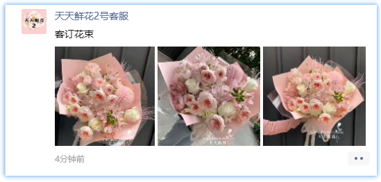

**朋友圈消息对象**指的是朋友圈中的每一条朋友圈，提供对朋友圈的各种操作，如获取朋友圈内容、点赞、评论等功能。

```python
# 获取朋友圈对象
moments = pyq.GetMoments()

# 获取第一条朋友圈
moment = moments[0]
```



:::info
这里的`moment`将在后续文档中用来指代朋友圈窗口对象，后续文档内不再重复定义。
:::

## 1. 获取朋友圈内容

```python
# 获取朋友圈内容
info = moment.info
# {
#     'type': 'moment',            # 类型，分为`朋友圈`和`广告`
#     'id': '4236572776458165',    # ID
#     'sender': '天天鲜花2号客服',   # 发送者
#     'content': '客订花束',        # 内容，就是朋友圈的文字内容，如果没有文字内容则为空字符串
#     'time': '4分钟前',            # 发送时间
#     'img_count': 3,              # 图片数量
#     'comments': [],              # 评论
#     'addr': '',                  # 发送位置
#     'likes': []                  # 点赞
# }

moment.sender
# '天天鲜花2号客服'

moment.content
# '客订花束'

moment.time
# '4分钟前'

# info中所有的键值对都可以通过对象的属性来获取，就不一一列举了
...
```

## 2. 获取朋友圈图片

- SaveImages()：保存朋友圈图片到本地

| 参数 | 类型 | 默认值 | 说明 |
| :---: | :---: | :---: | :---: |
| save_index | int \| list | None | 保存图片的索引，可以是一个整数或者一个列表，如果为None则保存所有图片 |
| savepath | str | None | 绝对路径，包括文件名和后缀，例如："D:/Images/微信图片_xxxxxx.jpg"，如果为None则保存到默认路径 |

```python
# 获取朋友圈图片
images = moment.SaveImages()
# [
#     'D:/Images/微信图片_xxxxxx1.jpg',
#     'D:/Images/微信图片_xxxxxx2.jpg',
#     'D:/Images/微信图片_xxxxxx3.jpg',
#     ...
# ]
```

## 3. 获取好友信息

```python
# 获取好友信息
moment.sender_info()
# {
#     'nickname': None,
#     'id': 'xxxxxxx',
#     'remark': None,
#     'tags': None,
#     'source': '通过搜索手机号添加',
#     'signature': None
# }
```