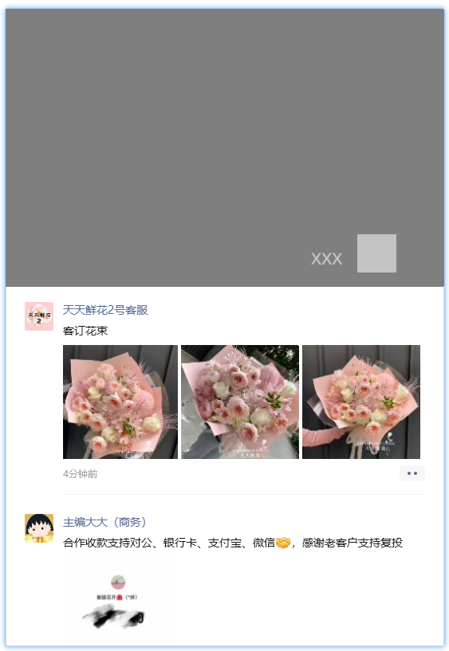

# 朋友圈窗口对象

**朋友圈窗口**对象指的是朋友圈的窗口对象，提供对朋友圈窗口的各种操作，如获取朋友圈内容、刷新、关闭等功能。

获取朋友圈对象
```python
from wxautox import WeChat

wx = WeChat()
pyq = wx.Moments()   
# 打开朋友圈并获取朋友圈窗口对象
# （如果为None则说明你没开启朋友圈功能，需要在手机端设置）
```



:::info
这里的`pyq`将在后续文档中用来指代朋友圈窗口对象，后续文档内不再重复定义。
:::

## 1. 获取朋友圈内容

`GetMoments`方法

|   参数    | 类型 | 说明  |                             说明                             |
| :-------: | :--: | :---: | :----------------------------------------------------------: |
| next_page | bool | False |                       是否翻页后再获取                       |
|  speed1   | int  |   3   |  翻页时的滚动速度，根据自己的情况进行调整，建议3-10自行调整  |
|  speed2   | int  |   1   | 翻页最后时的速度，避免翻页过多导致遗漏所以一般比speed1慢，建议1-3 |


```python
# 获取当前页面的朋友圈内容
moments = pyq.GetMoments()

# 通过`next_page`参数获取下一页的朋友圈内容
moments = pyq.GetMoments(next_page=True)
```
>
> 这里获取到的moments是一个列表，列表中每个元素都是一个**朋友圈对象**。
>

## 2. 刷新朋友圈

`Refresh`方法

```python
# 刷新朋友圈
pyq.Refresh()
```

## 3. 关闭朋友圈

`Close`方法

```python
# 关闭朋友圈
pyq.Close()
```